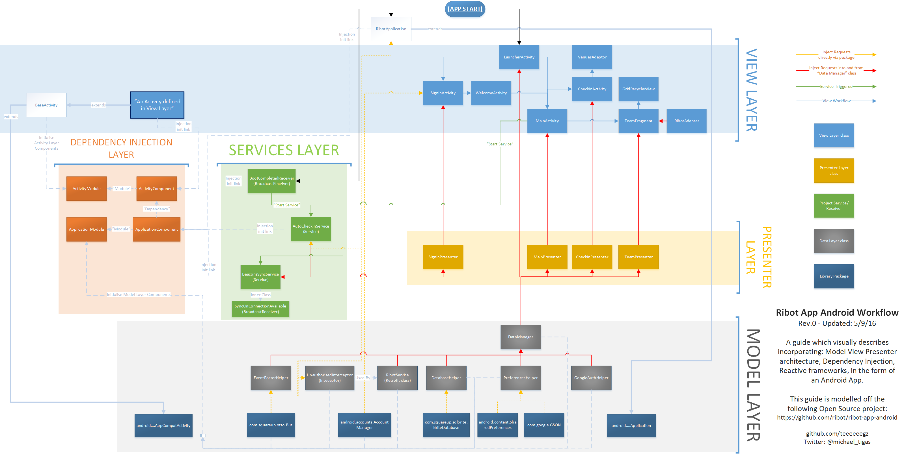

# ribot-app-android-workflow
A guide which visually describes incorporating: **Model View Presenter architecture**, **Dependency Injection**, **Reactive frameworks**, in the form of an Android App.

This guide is modelled off the following Open Source project:
https://github.com/ribot/ribot-app-android

    

I initially had created this diagram in *late 2015* when I began tinkering and teaching myself **MVP** (Model View Presenter) architecture, **Dagger 2** Dependency Injection, and **RxJava** (a Reactive framework); all mapped out on a BIG poster that will probably give you a headache trying to figure out where each line began and finished..... so I created this neat and elegant diagram! 

After showing a dev I work with, who didn't have previous knowledge of MVP, Dagger, or RxJava in Android, it all immediately "clicked" for him upon reading this diagram and suggested I open source this, in the event it may help others "click" with the concepts involved, enabling them to begin creating Apps that follow a modular, scalable, and most importantly, a "testable" coding standard!

Also a big shoutout to the guys at Ribot for being one of the original sources of knowledge for setting me on my path to become a better Android Developer. **You guys rock!**

Enjoy!
